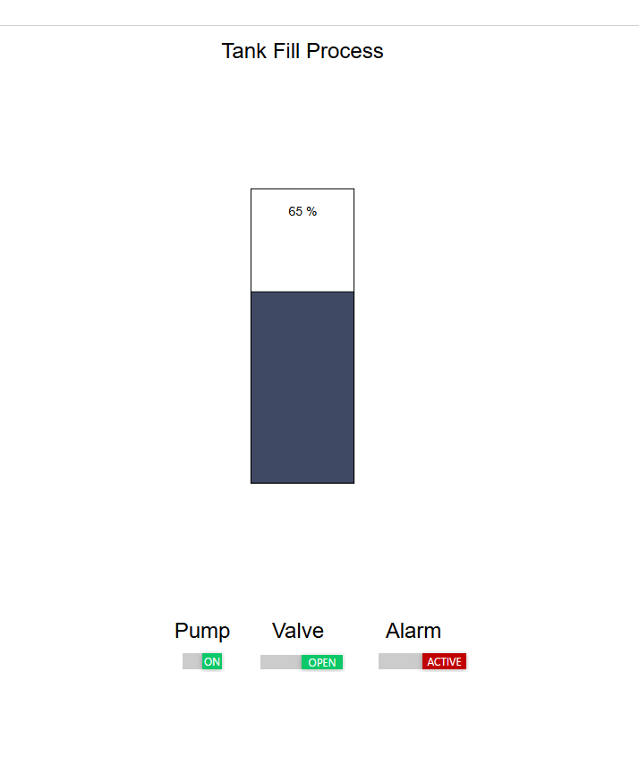
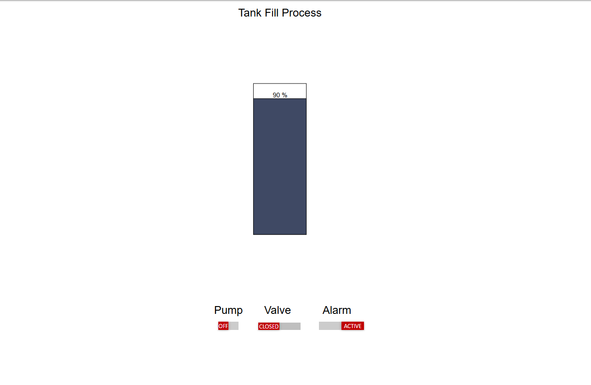
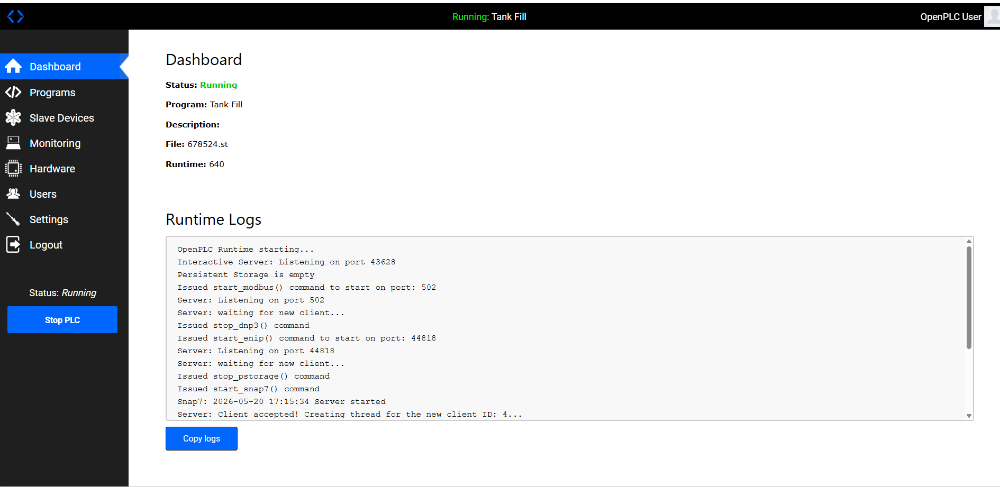
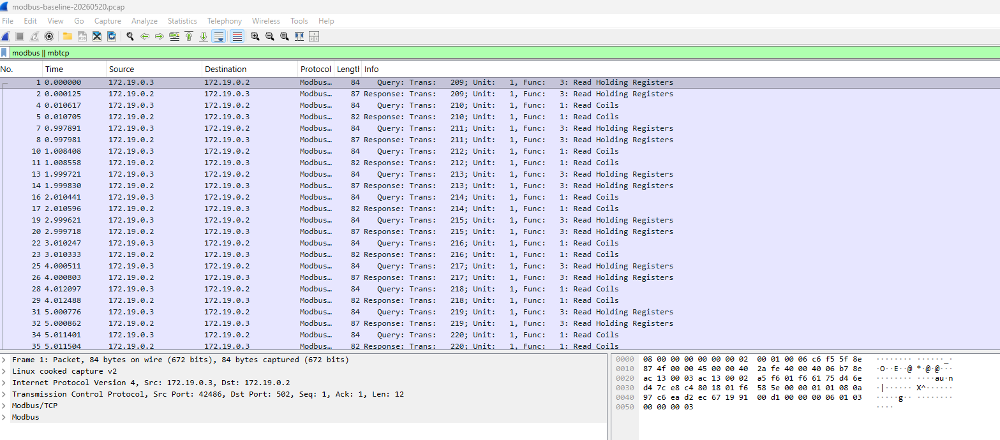

# OT/ICS Lab — Tank-Fill Process

A self-contained, vendor-neutral Operational Technology (OT) / Industrial
Control Systems (ICS) lab. It runs a realistic **PLC + HMI** control loop
for a generic plant tank-fill process, entirely in Docker, with deliberate,
defensible architecture and security decisions baked in.

This is a **portfolio / interview artifact**. The *reasoning* behind the
build choices is part of the project — see **Security Talking Points** below.

> **Scope:** Phase 1 of 2. Phase 1 = 2 services (PLC + HMI), 3 network zones,
> capturable Modbus/TCP traffic, supply-chain control, segmentation
> rationale — the architecture and monitoring foundation. **Phase 2 extends
> this into operational security** (attacker container in `attacker_zone`,
> Suricata detection firing on the Modbus indicators, written attack
> scenarios) and is documented backlog only — see `docs/MASTER.md`.



---

## What it is

A simulated plant tank with **level**, an **inlet valve**, a **fill pump**,
and a **high-level alarm**:

- **OpenPLC v3** runs the control logic (`plc/tank_fill.st`, IEC 61131-3
  Structured Text) and serves **Modbus/TCP** on port 502.
- **FUXA** is the operator HMI — it reads Modbus from the PLC and animates
  the tank, pump, valve, and alarm.
- The PLC program **simulates its own process** (there is no hardware in this
  lab, by design — see Security Talking Points). The tank fills when the pump
  + valve are active and continuously drains, so it cycles forever:
  fill → stop at high setpoint → drain → restart at low setpoint.

```
        ┌────────────┐   Modbus/TCP :502    ┌────────────┐
        │   FUXA HMI │  ───────────────────▶ │ OpenPLC v3 │
        │  (operator)│  ◀─────────────────── │   (PLC)    │
        └────────────┘   level / pump /      └────────────┘
                          valve / alarm
```

**Control behavior** (hysteresis — real-plant practice, no pump short-cycling):

| Condition | Action |
|---|---|
| Level ≤ 20 % | Start pump + open inlet valve (begin filling) |
| Level ≥ 80 % | Stop pump + close valve (begin draining) |
| Level ≥ 90 % | High-high alarm ON |



---

## Modbus map (PLC → HMI)

OpenPLC v3 fixed addressing. FUXA connects as a Modbus client and reads:

| Tag | ST address | Modbus object | Address |
|---|---|---|---|
| Tank level (0–100 %) | `%QW0` | Holding Register | 0 |
| Low setpoint (display) | `%QW1` | Holding Register | 1 |
| High setpoint (display) | `%QW2` | Holding Register | 2 |
| Pump running | `%QX0.0` | Coil | 0 |
| Valve open | `%QX0.1` | Coil | 1 |
| High-high alarm | `%QX0.2` | Coil | 2 |

---

## Prerequisites

| Requirement | Notes |
|---|---|
| Windows + **Docker Desktop** | **WSL2 integration enabled for this distro** — MANUAL one-time setup |
| WSL2 distro | Clone this repo to any path on your WSL2 filesystem — referenced as `<repo-root>` throughout these docs |
| **Wireshark** (on Windows) | For the Modbus capture exercise — `docs/monitoring.md` |
| ~2 GB disk + a few minutes | First run **builds OpenPLC from source** (see below) |

> **WSL2 networking rule (memorize this — it causes most first-run pain):**
> - From the **Windows browser**: always use `http://localhost:<port>`.
> - **Container → container**: always use the **service name**, never
>   `localhost`. `localhost` inside a container is *that container*.

---

## Setup & Run

From the repo root, in the WSL2 shell:

```bash
docker compose up --build
```

**First run builds OpenPLC v3 from a pinned upstream commit** (no Docker Hub
image — see Security Talking Points). This takes a few minutes and is
expected. Subsequent runs reuse the built image and start in seconds.

Once both containers are up:

| Service | URL (Windows browser) | Default login |
|---|---|---|
| OpenPLC web editor | `http://localhost:8080` | `openplc` / `openplc` |
| FUXA HMI | `http://localhost:1881` | set on first launch |

### Load the control program into the PLC  *(MANUAL — web UI)*

1. Open `http://localhost:8080`, log in (`openplc` / `openplc`).
2. **Programs → Choose File →** select `plc/tank_fill.st` **→ Upload**.
3. Give it a name, **Upload program**. OpenPLC compiles it (MATIEC).
   - If compilation errors appear: Structured Text is niche and the
     compiler is strict — a small fix pass on first upload is **expected**,
     not a blocker (see Troubleshooting → *ST compile errors*).
4. **Dashboard → Start PLC**. The runtime now serves Modbus/TCP on 502.
5. **Settings → enable "Auto-start PLC at OpenPLC startup"**. One-time setup
   per fresh clone — the setting lives in `openplc.db` and persists via the
   `otlab_openplc_state` named volume, so subsequent
   `docker compose down`/`up` cycles resume the PLC automatically.



### Wire up the FUXA HMI  *(MANUAL — web UI)*

1. Open `http://localhost:1881`, complete first-launch admin setup.
2. **Connections → add a Modbus TCP device:**
   - **Host:** `openplc`  ← the service name, **NOT** `localhost`/`127.0.0.1`
   - **Port:** `502`
3. Add tags from the Modbus map above (Holding Register 0 = level; Coils
   0/1/2 = pump/valve/alarm).
4. Build a simple screen: a tank fill bar bound to level, lamps for
   pump/valve/alarm. The HMI now animates as the tank cycles.

---

## Test / verify it works

You have a working lab when **all** of these are true:

- [ ] `docker compose up --build` brings up `otlab-openplc` + `otlab-fuxa`.
- [ ] `tank_fill.st` compiles and the PLC is **Running** in OpenPLC.
- [ ] FUXA's Modbus device shows **connected** to `openplc:502`.
- [ ] The HMI tank level **rises to ~80 %, stops, drains to ~20 %, repeats**.
- [ ] Pump/valve lamps follow the fill cycle; alarm trips above 90 %.
- [ ] Modbus/TCP packets are capturable in Wireshark (`docs/monitoring.md`).

Quick host-side Modbus reachability check (optional):

```bash
# Port 502 is published to the host so Wireshark / a Modbus client on
# Windows can reach it. Container-to-container Modbus does NOT use this.
docker compose ps
ss -tlnp | grep ':502' || echo "502 not listening yet — start the PLC"
```

---

## Screenshots

Portfolio screenshot index. Captured files live in `docs/img/`; pending
rows are MANUAL follow-ups for a later live-run session (per the
authoring-discipline rule in `docs/MASTER.md`).

| File | Shows | Status |
|---|---|---|
| `docs/img/openplc-running.png` | OpenPLC dashboard, PLC **Running**, program loaded | Captured 2026-05-20 |
| `docs/img/fuxa-hmi.png` | FUXA screen mid-cycle (tank ~half, pump ON) | Captured 2026-05-19 |
| `docs/img/fuxa-alarm.png` | FUXA with high-high alarm active | Captured 2026-05-20 |
| `docs/img/wireshark-modbus.png` | Wireshark filtered on `modbus` (`docs/monitoring.md`) | Captured 2026-05-20 |

*(Pending captures require a live run on your machine and can't be
auto-generated.)*

---

## Security Talking Points  *(the "why" — this is the interview story)*

### 1. Supply-chain control — OpenPLC built from pinned source

There is no official OpenPLC image on Docker Hub; every prebuilt one is
community-maintained with unverified provenance. For a *security* lab,
pulling an unvetted PLC image would contradict the whole point. So the PLC
is built from the official upstream repo, pinned to one immutable commit
(`plc/Dockerfile`): inspectable before it runs, reproducible, no trust in an
anonymous publisher.

### 2. Least privilege — no `--privileged`

Upstream's sample run command uses `--privileged` for GPIO/hardware I/O.
This lab has no hardware, so privileged mode is **deliberately not set**.
The PLC program simulates the process internally instead. Smaller blast
radius, demonstrated on purpose.

### 3. Reproducibility — every image pinned

`frangoteam/fuxa:1.3.1` and a pinned Debian base, never `:latest`. The lab
that runs today is the lab that runs in six months.

### 4. Network segmentation — `attacker_zone` is the real boundary

Three Docker networks: `ot_zone` (process/Modbus), `mgmt_zone` (human web
access), `attacker_zone` (defined, **intentionally empty** in Phase 1).
Docker bridge networks are isolated by default, so a container placed only
in `attacker_zone` has no route to `ot_zone` — that is the enforcement
boundary Phase 2's attacker container will probe. Honest scope note: in
Phase 1 the two legitimate services are multi-homed on `ot_zone` +
`mgmt_zone` for usability; the genuinely demonstrable boundary is
`attacker_zone`. Full rationale in `docs/network-security.md`.

### 5. Defense-relevant visibility — Modbus has no authentication

Modbus/TCP is plaintext and unauthenticated by design. Capturing it in
Wireshark (`docs/monitoring.md`) shows exactly what an on-path attacker in
the OT network would see and could forge — the core OT security lesson.



---

## Troubleshooting

### OpenPLC build is slow / fails on first `up`

Expected: the first run compiles OpenPLC from source (pinned commit). Give
it a few minutes. If the build fails on the `git clone`/`checkout` step,
it's almost always network/DNS for the HTTPS clone — re-run
`docker compose up --build`. The build fails *loudly* on a bad commit
checkout by design; it never silently falls back to a branch tip.

### Runtime misbehaves without `--privileged`

Not expected in this lab (no hardware I/O). If the OpenPLC runtime genuinely
won't start the program, that points to an ST/compile issue, not privilege —
see below. Adding `--privileged` is **not** the fix here and would undo a
deliberate security decision; investigate the program first.

### ST compile errors in the OpenPLC editor

Structured Text + the MATIEC compiler are strict. Common first-upload fixes:
integer literal typing, the `AT %QWn` direct-mapping syntax, or `TASK`
interval format. Adjust `plc/tank_fill.st`, re-upload, re-compile. This is a
known, tracked risk (`docs/MASTER.md`), not a project blocker.

### FUXA can't reach the PLC ("connection refused" / no data)

The #1 first-time failure. In the FUXA Modbus device the host **must** be
`openplc` (the service name) on port `502` — **not** `localhost` or
`127.0.0.1`. Containers reach each other by service name on the shared
`ot_zone` network; `localhost` inside FUXA is FUXA itself. Also confirm the
PLC shows **Running** in OpenPLC (a stopped PLC serves no Modbus).

### FUXA screen is gone after `docker compose down`/recreate

The HMI project persists to `./fuxa/appdata` via a bind mount. If it
vanished, that volume line in `docker-compose.yml` isn't taking effect —
verify the path and that you ran from the repo root.

### OpenPLC state is gone after a Dockerfile rebuild

OpenPLC state (uploaded programs, login, "Auto-start PLC" setting) lives in
a named volume `otlab_openplc_state`. Routine `docker compose down` followed
by `up` preserves this volume. **If you change `OPENPLC_COMMIT` in
`plc/Dockerfile`** (or otherwise need to refresh the image's webserver code),
the named volume still holds the *old* commit's code and state. Run
`docker compose down -v` before the next `docker compose up --build` so the
new image seeds a fresh volume. One-time cost when bumping the pinned
commit, not routine.

### Disaster recovery — OpenPLC web UI dead after a restart, runtime not starting

**Symptom.** After a Docker Desktop restart or a `docker compose down`/`up`
cycle, the OpenPLC web UI at `http://localhost:8080` is unreachable
(connection refused, or the page never loads), and the PLC runtime isn't
serving Modbus on `:502` either. FUXA can't connect.

**Cause.** Out-of-sync internal state: the named volume preserved
`openplc.db`, but the `Programs` table row for the active program is
missing while OpenPLC's `active_program` pointer file still references it.
At startup, the webserver queries the Programs table, gets no row, and
crashes with `TypeError: 'NoneType' object is not subscriptable`. The
runtime can't start because no program is loadable.

**Diagnose.** Confirm the crash signature in the container logs:

```bash
docker logs otlab-openplc 2>&1 | grep -A3 "NoneType"
```

If you see `TypeError: 'NoneType' object is not subscriptable` at
`webserver.py:2726`, this is the failure.

**Recover.** Restore the missing Programs row from inside the container:

```bash
# 1. Find the filename the pointer references
docker exec otlab-openplc cat /opt/OpenPLC_v3/webserver/active_program
#    Output is something like: 927367.st

# 2. Insert the matching Programs row (substitute YOUR filename from step 1)
docker exec otlab-openplc sqlite3 /opt/OpenPLC_v3/webserver/openplc.db \
  "INSERT INTO Programs (Name, Description, File, Date_upload) VALUES \
   ('Tank Fill', 'Generic plant tank-fill process', '<filename>', strftime('%s','now'));"

# 3. Restart so OpenPLC re-reads state
docker compose restart openplc
```

**Verify.** `curl -I http://localhost:8080` should return `HTTP/1.1 302
Found` (redirect to login). FUXA reconnects automatically once the PLC
runtime is up. Full `docker compose down`/`up -d` cycle should now succeed
cleanly — the recovery is persistent because the inserted row lives in the
named volume.

Tracked in `docs/MASTER.md` Known Risks; this is an OpenPLC v3 brittleness
(no transactional linkage between the pointer file and the DB row), not a
lab bug.

---

## Project layout

```
ot-ics-lab/
├── docker-compose.yml      2 services, 3 networks
├── plc/
│   ├── Dockerfile          OpenPLC v3, pinned upstream source
│   └── tank_fill.st        control logic + process model (ST)
├── fuxa/appdata/           FUXA HMI persistence (bind mount)
├── captures/               Wireshark .pcap output (gitignored)
└── docs/
    ├── MASTER.md           status & index (source of truth)
    ├── architecture.md     components, data flow, zones
    ├── network-security.md segmentation rationale
    └── monitoring.md       Wireshark Modbus capture guide
```

---

## Status

Phase 1 build progress is tracked in **`docs/MASTER.md`** (single source of
truth). Phase 2 backlog is listed there too.

---

## License

MIT — see [`LICENSE`](LICENSE).
