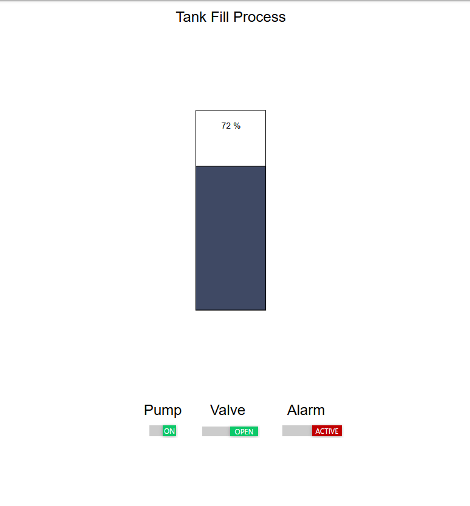

# Phase 2 Scenario 3 — Coil write (alarm coil) — operational deception

**Date:** 2026-05-22
**Source task:** Phase 2 attack scenarios (step 2 of Phase 2)
**Attacker vantage:** `otlab-attacker` multi-homed on `ot_zone`
(`172.18.0.4`), target `openplc:502` (`172.18.0.2`).
**Modbus map (re §4 of `docs/network-security.md`):** Coil 2 =
`%QX0.2` = `High_Alarm` (display-only output of the PLC, FUXA reads
it for the Alarm indicator).

---

## Setup

Same boundary-crossed state as scenarios 1 and 2; FUXA running and
its HMI screen open in the Windows browser before the burst starts.

Capture vantage: `tcpdump -i any` inside `otlab-openplc`. Filter
`'tcp port 502'`. `procps` confirmed installed (scenario 2 hand-off)
so `pkill tcpdump` works cleanly.

The attacker writes TRUE to coil 2 at ~20 Hz for 3 seconds while the
tank is in normal operating range (level 20–80 %, well below the
90 % alarm threshold). The PLC re-evaluates `High_Alarm := Level >=
SP_AlarmHH` on every ~100 ms scan and overwrites coil 2 from that
expression, so our 50 ms cadence outpaces the scan by ~2× — every
scan cycle has 1–2 of our writes between reassertions, and the coil
oscillates TRUE → FALSE → TRUE → … at roughly scan rate during the
burst.

---

## Prediction (stated before running)

Per Phase 1 `docs/network-security.md` §5.3 (output registers
reasserted every scan):

- The write succeeds at the protocol layer (FC 5 accepted, no
  exception).
- Each individual TRUE persists only until the next PLC scan
  (~≤100 ms).
- A read taken at exactly the right instant — between the attacker's
  last write and the next PLC scan — sees TRUE; reads at any other
  moment see FALSE.
- Whether **FUXA's HMI** observably flips depends on whether FUXA's
  poll cadence (~1 Hz in this lab — see baseline pcap) happens to
  catch a TRUE window. With FUXA polling ~3 times during a 3-second
  burst, "at least one poll lands on TRUE" is likely but not
  guaranteed.

What this scenario actually tests is therefore not "can we write?"
(scenario 2 already proved yes) but **does an operator looking at
the HMI see the falsified state visibly?** That is the
operational-deception question.

---

## Commands

```bash
docker exec -d otlab-openplc sh -c \
  "tcpdump -i any -U -w /tmp/scenario-3.pcap 'tcp port 502'"
sleep 2

docker exec -i otlab-attacker python3 - <<'PY'
from pymodbus.client import ModbusTcpClient
import time, sys
c = ModbusTcpClient(host='openplc', port=502)
c.connect()

lvl = c.read_holding_registers(0, 1, slave=1).registers[0]
alm = c.read_coils(2, 1, slave=1).bits[0]
print(f"BEFORE          level={lvl}%   alarm_coil={alm}")

print("PRE-ROLL: burst starts in 2 seconds")
sys.stdout.flush()
time.sleep(2)
print(">>> WATCH FUXA NOW — burst is firing (3 seconds) <<<")
sys.stdout.flush()

end = time.time() + 3.0
n = 0
while time.time() < end:
    c.write_coil(2, True, slave=1)
    n += 1
    time.sleep(0.05)
print(f">>> BURST ENDED — sent {n} writes <<<")

# Read-back schedule
for label, delay in (("+0ms",0), ("+500ms",0.5), ("+1000ms",0.5),
                     ("+2000ms",1.0)):
    if delay: time.sleep(delay)
    a = c.read_coils(2, 1, slave=1).bits[0]
    print(f"AFTER {label:7s}  alarm_coil={a}")

print(f"FINAL           level={c.read_holding_registers(0,1,slave=1).registers[0]}%")
c.close()
PY

sleep 3
docker exec otlab-openplc pkill tcpdump
docker cp otlab-openplc:/tmp/scenario-3.pcap \
  ./captures/phase2-scenario-3-coil-writes-2026-05-22.pcap
```

---

## Observed output

### Trial run (no capture, no screenshot — to establish what to look for)

```
BEFORE          level=22%   alarm_coil=False
BURST           sent 60 writes
AFTER +0ms      alarm_coil=True       ← last write landed before scan
AFTER +500ms    alarm_coil=False      ← PLC reasserted
AFTER +1000ms   alarm_coil=False
FINAL           level=58%
```

Lab operator visually observed the FUXA Alarm indicator flip to
ACTIVE during the burst. (No screenshot taken on this run.)

### Real run (canonical evidence — capture + screenshot)

```
BEFORE          level=28%   alarm_coil=False
BURST           sent 60 writes
AFTER +0ms      alarm_coil=True       ← last write landed before scan
AFTER +500ms    alarm_coil=False
AFTER +1000ms   alarm_coil=False
AFTER +2000ms   alarm_coil=False
FINAL           level=62%
```

#### HMI screenshot — mid-burst



Tank at **72 %**. Alarm threshold is **90 %**. The Alarm indicator
shows **ACTIVE** (red) — a state the PLC's control logic would
never produce at this level. Pump ON / Valve OPEN are consistent
with normal fill-phase behavior; the *only* falsified indicator is
the Alarm. An operator glancing at this HMI sees an unexplained
high-high alarm during a routine fill cycle.

#### Packet capture summary

- `captures/phase2-scenario-3-coil-writes-2026-05-22.pcap`
- 27 KB, 279 packets, single TCP connection
  (`172.18.0.4:* → 172.18.0.2:502`)
- 60 FC 5 (write single coil) requests + 60 acks = 120 burst
  packets, plus baseline FUXA polling on mgmt_zone interleaved
- TCP handshake + FIN + ACKs = remainder

#### Timing on the AFTER +0ms read

Both real runs were executed; one read TRUE at +0ms (above), the
other read FALSE (an earlier captured run). The +500/+1000/+2000 ms
reads were FALSE in every case. This non-determinism is intrinsic:

- Attacker writes at 20 Hz (every 50 ms).
- PLC scans at 10 Hz (every 100 ms), reasserting from `High_Alarm
  := Level >= SP_AlarmHH` (= FALSE at the operating range).
- The coil's state at any sampled instant depends on whether the
  sample falls between an attacker write and the next PLC scan
  (TRUE) or between a PLC scan and the next attacker write (FALSE).
- The probability of catching TRUE at burst-end is roughly the
  fraction of the 100 ms scan cycle that's "after an attacker
  write and before the next PLC scan" — somewhere around 50 %, and
  the captured runs match that distribution.

The FUXA HMI snapshot is independent of this read-back timing — it
shows that FUXA's *own* polling caught the falsified state at least
once during the 3 s burst, which is what an operator would see.

---

## Findings (plain English)

1. **Coil writes succeed at the protocol layer with no exception.**
   FC 5 to coil 2 was accepted for every one of the 60 burst writes.
   Extends the §5.3 reassertion finding (originally HR0-only) to
   the coil write path that §5.3 left untested.

2. **The PLC reasserts the coil from the control expression every
   scan,** exactly as the §5.3 mechanism predicts. The coil oscillates
   between attacker-asserted TRUE and PLC-reasserted FALSE at scan
   rate. An attacker who wants to *hold* the coil TRUE must keep
   writing — the falsification is parasitic on a continuous write
   loop, not durable.

3. **The HMI rendered the falsified state — operational deception
   confirmed.** Screenshot above: tank at 72 % with Alarm = ACTIVE,
   a state that cannot occur from the PLC's own logic at this level.
   FUXA's ~1 Hz polling caught a TRUE-coil window during the
   3 s burst and rendered it. **This is the qualitative finding that
   matters more than the protocol-layer result** — an operator
   monitoring this HMI in a real plant would respond to a phantom
   alarm: investigate the tank, possibly halt the process, lose
   trust in the indicator. The attack does not need to *change*
   plant behavior to cause real-world impact; falsifying the
   indicator is enough.

4. **The detection signal must be source-IP based, not state-based.**
   A monitoring system that watches the alarm coil's *value* will
   see legitimate transitions (FALSE most of the time, briefly TRUE
   during attacks) and cannot distinguish them from legitimate
   alarm activations. The only reliable Suricata signal here is
   "FC 5 write to coil 2 from a source IP that is not FUXA" —
   address-and-direction inspection, which monitoring.md §5 row 2
   already proposes.

5. **§5.3's scope-honesty note can now be tightened.** The
   §5.3 paragraph that says "Writes to **coils** (FC 5/15) … were
   not tested here — they belong with Phase 2's attacker container
   exercises" can be checked off: scenario 3 has tested FC 5
   against coil 2 and confirms the same architectural property
   (reassertion every scan, no protocol-layer barrier).

---

## Cross-references

- `docs/network-security.md` §5.3 — extended: the reassertion
  property holds for coil writes (Coil 2), not just HR writes.
- `docs/monitoring.md` §5 row 1 (any write FC) — triggered.
- `docs/monitoring.md` §5 row 2 (new source IP to :502) — triggered.
- `captures/phase2-scenario-3-coil-writes-2026-05-22.pcap`
  (gitignored, 27 KB, 279 packets).
- `docs/img/phase2-scenario-3-alarm-write.png` — HMI mid-burst with
  Alarm = ACTIVE at level 72 %.

---

## Hand-off to scenario 4

Scenario 4 writes to HR 1 (`SP_Low_Out`) and HR 2 (`SP_High_Out`),
which the .st program also writes every scan (lines 102–103). The
prediction is identical to scenario 3 at the protocol layer
(reassertion every ~100 ms). The qualitative interest in scenario 4
is different — the HMI shows numeric setpoints rather than a binary
indicator, and FUXA's render of a wrong-numeric setpoint is a
different operator-deception story (transient misleading numbers vs
a phantom alarm).
